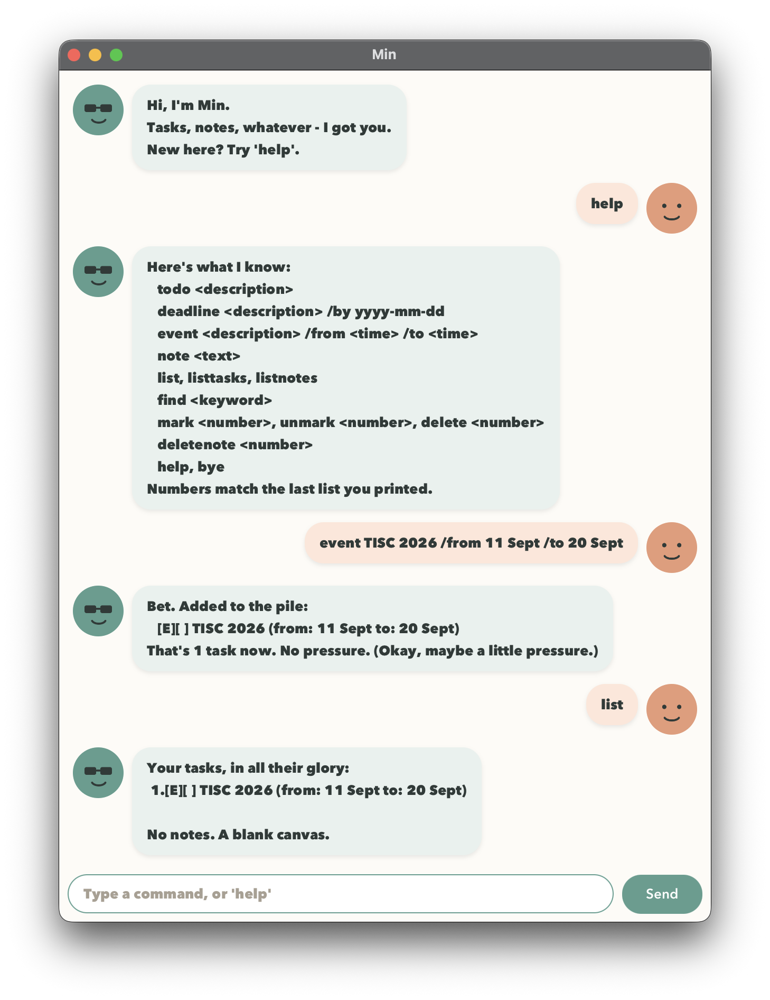

# Min User Guide

Min is a desktop chatbot that helps you keep track of tasks, deadlines, events, and notes. Type commands into the chat to add items, find them, and track what you have finished.



- [Quick start](#quick-start)
- [Command format](#command-format)
- [Features](#features)
  - [Adding entries](#adding-entries)
  - [Listing and finding entries](#listing-and-finding-entries)
  - [Marking and deleting entries](#marking-and-deleting-entries)
  - [Help and exit](#help-and-exit)
- [Saving your data](#saving-your-data)
- [Command summary](#command-summary)
- [Troubleshooting](#troubleshooting)

## Quick start

1. Install **Java 25**. Check your version by running `java -version` in a terminal.
2. Place `min.jar` in a folder where you want to keep Min's data. If you are starting from the source project, run `./gradlew shadowJar` from the project folder (`.\gradlew.bat shadowJar` in Windows PowerShell). The JAR will be created at `build/libs/min.jar`.
3. Open a terminal in the folder containing `min.jar` and run:

   ```sh
   java -jar min.jar
   ```

4. When the chat window appears, type a command in the text box at the bottom. Press **Enter** or click **Send**.
5. Try these commands one at a time:

   ```text
   todo read chapter 2
   deadline submit assignment /by 2026-09-30
   note bring calculator to class
   list
   mark 1
   ```

   Min adds two tasks and a note, lists them, and then marks the first task as complete.

You can also run Min directly from the source project using `./gradlew run`, or use `./gradlew runCli` for the terminal interface. In Windows PowerShell, use `.\gradlew.bat` instead of `./gradlew`. Both interfaces accept the same commands.

## Command format

- Words in `UPPER_CASE` are placeholders to replace with your own text. For example, `todo DESCRIPTION` becomes `todo read chapter 2`.
- Commands are case-sensitive: use `todo`, not `TODO`.
- Enter one command per line. Separate the command word from its arguments with a space.
- Keep spaces around `/by`, `/from`, and `/to`, and use them in the order shown.
- Descriptions, note text, and event start and end values must not be empty or contain the exact sequence `' | '` (a vertical bar with a space on either side).
- Commands without arguments, such as `help` and `list`, must be entered on their own.

### Understanding item numbers

Tasks and notes have **separate numbered lists**, each starting at 1. Commands that use an index act on the most
recently displayed relevant list. `mark`, `unmark`, and `delete` use the latest task list, while `deletenote` uses the
latest note list. After `find`, they use the numbering shown in those search results.

- `list` restores both complete lists. `listtasks` restores only the task list; `listnotes` restores only the note list.
- Deleting an item shifts later numbers down. Run `list` or repeat your search to see the updated numbers before selecting another item.
- Adding an item after a search does not refresh the search results. Run `list` or repeat `find` to see it.

## Features

### Adding entries

- #### Adding a todo: `todo`

  Adds a task without a date or time. New tasks start as incomplete.

  **Format:** `todo DESCRIPTION`

  **Example:** `todo read chapter 2`

  Min confirms the addition, displays `[T][ ] read chapter 2`, and reports the total number of tasks.

- #### Adding a deadline: `deadline`

  Adds a task that must be completed by a particular date.

  **Format:** `deadline DESCRIPTION /by yyyy-mm-dd`

  Use a valid calendar date with a four-digit year, two-digit month, and two-digit day. For example, `2026-09-30` is valid; `30/09/2026` and `2026-02-30` are not. Deadlines accept a date only, without a time.

  **Example:** `deadline submit assignment /by 2026-09-30`

  Min adds the task and displays:

  ```text
  [D][ ] submit assignment (by: Sep 30 2026)
  ```

- #### Adding an event: `event`

  Adds a task with a start and end.

  **Format:** `event DESCRIPTION /from START /to END`

  The start and end are text, so you can use values such as `Monday 2pm` or `2026-09-20 14:00`. Min displays them as entered and does not check whether the end is after the start. Use `/from` and `/to` exactly once each.

  **Example:** `event study group /from Monday 2pm /to Monday 4pm`

  Min adds the event and displays:

  ```text
  [E][ ] study group (from: Monday 2pm to: Monday 4pm)
  ```

- #### Adding a note: `note`

  Saves a piece of text you want to remember. Notes do not have a completion status.

  **Format:** `note TEXT`

  **Example:** `note bring calculator to class`

  Min confirms the saved text and reports the total number of notes.

### Listing and finding entries

- #### Listing items: `list`, `listtasks`, `listnotes`

  Use one of these commands to view your saved items:

  | Command | Result |
  | --- | --- |
  | `list` | Shows all tasks, followed by all notes. |
  | `listtasks` | Shows all tasks. |
  | `listnotes` | Shows all notes. |

  Tasks appear in the order they were added. `[T]` identifies a todo, `[D]` a deadline, and `[E]` an event. `[ ]` means incomplete; `[X]` means complete. Notes appear as plain text in their own numbered list.

  For example, after adding the examples above, `list` shows:

  ```text
  Your tasks, in all their glory:
   1.[T][ ] read chapter 2
   2.[D][ ] submit assignment (by: Sep 30 2026)
   3.[E][ ] study group (from: Monday 2pm to: Monday 4pm)

  And the notes you jotted down:
   1.bring calculator to class
  ```

  If a list is empty, Min tells you there are no items to show.

- #### Finding tasks and notes: `find`

  Searches task descriptions and note text, showing matching tasks and notes separately.

  **Format:** `find KEYWORD`

  - Matching is **case-sensitive**: `find book` does not match `Book`.
  - Partial text matches: `find book` matches `read textbook`.
  - Several words are treated as one phrase: `find study group` matches text containing `study group` in that order.
  - Deadline dates and event start and end values are not searched.

  **Example:** `find chapter`

  With the sample items above, Min shows `read chapter 2` as task 1 and reports no matching notes. Entering `mark 1` then completes that matching task. Enter `list` to return to all tasks and notes.

### Marking and deleting entries

- #### Marking a task as complete: `mark`

  Changes the selected task's status to complete (`[X]`). The task stays in the list.

  **Format:** `mark INDEX`

  **Example:** Enter `listtasks`, then `mark 1` to complete the first task shown. If that task is `read chapter 2`, Min displays:

  ```text
  W. Nice, one down:
     [T][X] read chapter 2
  ```

- #### Marking a task as incomplete: `unmark`

  Changes the selected task's status back to incomplete (`[ ]`).

  **Format:** `unmark INDEX`

  **Example:** `unmark 1` makes the first task in the current task list incomplete again. Min confirms the change and displays the updated task.

- #### Deleting a task: `delete`

  Removes a task and reports how many tasks remain.

  **Format:** `delete INDEX`

  **Example:** Enter `listtasks`, then `delete 2` to remove the second task shown.

  Deletion takes effect immediately. There is no undo command.

- #### Deleting a note: `deletenote`

  Removes a note and reports how many notes remain.

  **Format:** `deletenote INDEX`

  **Example:** Enter `listnotes`, then `deletenote 1` to remove the first note shown.

  Deletion takes effect immediately. There is no undo command.

### Help and exit

- #### Viewing help: `help`

  Shows the available commands and their formats in the chat.

  **Format and example:** `help`

- #### Exiting Min: `bye`

  Displays a farewell and closes Min. In the desktop interface, the window closes after a short delay.

  **Format and example:** `bye`


## Saving your data

Min automatically saves tasks and notes when you add, mark, unmark, or delete them. There is no separate save command. Saved items are loaded the next time you start Min.

- Tasks are stored in `data/min.txt`.
- Notes are stored in `data/notes.txt`.

These paths are relative to the folder from which you launch Min. Start Min from the same folder each time to use the same data. Missing data files are treated as empty lists and are created when needed.

To back up or transfer your items, close Min and copy the `data` folder. On another computer, place it in the folder from which you will launch Min. The chat history is not saved.

## Command summary

| Action | Format | Example |
| --- | --- | --- |
| View help | `help` | `help` |
| Add a todo | `todo DESCRIPTION` | `todo read chapter 2` |
| Add a deadline | `deadline DESCRIPTION /by yyyy-mm-dd` | `deadline submit assignment /by 2026-09-30` |
| Add an event | `event DESCRIPTION /from START /to END` | `event study group /from Monday 2pm /to Monday 4pm` |
| Add a note | `note TEXT` | `note bring calculator to class` |
| List all items | `list` | `list` |
| List tasks | `listtasks` | `listtasks` |
| List notes | `listnotes` | `listnotes` |
| Find items | `find KEYWORD` | `find chapter` |
| Complete a task | `mark INDEX` | `mark 1` |
| Reopen a task | `unmark INDEX` | `unmark 1` |
| Delete a task | `delete INDEX` | `delete 2` |
| Delete a note | `deletenote INDEX` | `deletenote 1` |
| Exit | `bye` | `bye` |

## Troubleshooting

| Problem | What to do |
| --- | --- |
| Min does not recognize a command. | Check the spelling and lowercase command word. Enter `help` to see the supported formats. |
| A deadline date is rejected. | Use a real date in `yyyy-mm-dd` format, such as `2026-09-30`. |
| An item number is rejected. | Use a positive whole number from the current task or note list. Run `list` to see all available items. |
| A search returns no matches. | Check capitalization and spelling. Min searches task descriptions and note text. Use `list` to see everything again. |
| Saved items appear to be missing. | Launch Min from the folder containing your original `data` folder. |
| Min reports that it could not save. | Check that the launch folder is writable and your disk has space. The change may still appear in the current session without being saved. |
| Min cannot open saved data. | Check that the data files are readable. If a file is reported as damaged, keep a backup and restore a valid copy before restarting Min. |
